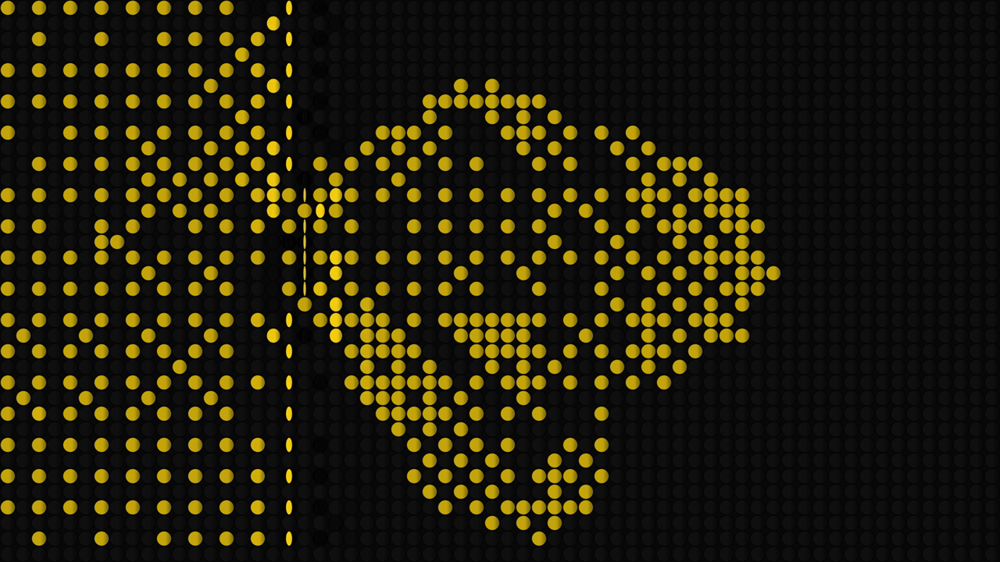
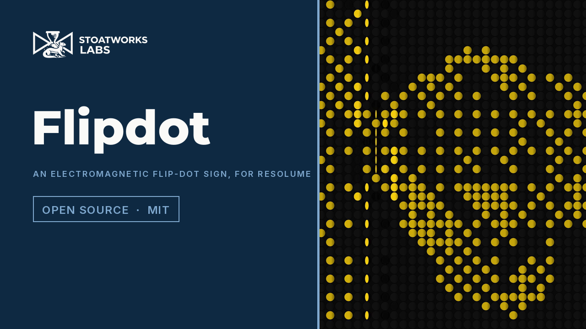

# flipdot

> **AI-assisted project.** This codebase was created with [Claude](https://claude.com/claude-code)
> (Anthropic), directed and reviewed by a human author. Every claim below is
> *measured* off the rendered picture by an offline harness that drives the
> real plugin class in a headless GL context, at 640×360 and at 320×180, on
> this Mac's GPU and again on Apple's software renderer: after a whole-sign
> change the discs of line L complete their swing on frame
> **⌈2.4 L + 6.5⌉ exactly**, every line, by column, by row and on Resolume's
> 499,000,000 ms clock (`fdtest --wipe`); Only Changes moves **exactly** the
> discs whose target differs and Refresh All moves every disc (`--changes`);
> with no update the sign holds **bit for bit** (`--bistable`); exactly
> round(f × N) discs are stuck and never move (`--stuck`); the colour face's
> width follows the stated swing within **1.1 px** against the harness's own
> integration of the torques (`--rotation`); a resize and a regrid keep every
> disc's side (`--resize`); loud audio on frame one fires nothing
> (`--prime`). Ten negative controls, each of which must fail, all do. Every
> one of the 19 controls is proven to change the picture at both rasters,
> and the bundle registers, instantiates and lights pixels under the fleet's
> oxbow host. On Windows it passes the fleet's Arena gate, 9 of 9, in
> Resolume Arena 7.27.1 on software rendering. **It has never been loaded
> into Resolume on macOS.**

The picture on an electromagnetic flip-dot sign. An FFGL **effect** for
Resolume Arena and Avenue.

A frame of the project video: Update Now pressed on a Manual sign that kept
the sphere through a clip cut, the new picture wiping across at 30 columns a
second. Rendered by the plugin's offline harness (`fdtest --pipe`) from one of
Resolume's bundled demo clips, not captured from Resolume.

*[Watch it](https://www.youtube.com/watch?v=dSpM8189HsQ) — 73 seconds at 60 fps:
the sphere at the defaults, a Manual sign keeping its picture through a clip cut and Update Now
wiping the new one across, a 32 by 18 sign two times up with half-second swings rebounding off
their stops and then shivering under Refresh All, a row-by-row pass, Onset under a synthetic
spectrum, the three dithers on a 128 by 72 sign, an old sign with a fifth of its discs stuck,
and green and white discs. Rendered through `fdtest --pipe` from Resolume's bundled demo clips,
not captured from Resolume.*

## The one idea

A flip-dot sign is a grid of small discs, black on one side and fluorescent
on the other, each with a magnet in it between the poles of a coil. A pulse
of current one way swings a disc to its colour face, the other way to black,
and **the disc stays where it is with no power**. The driver board scans: it
pulses one column at a time, so a whole-sign change sweeps across the sign at
the scan rate, and it only pulses the discs that need to change. Nothing is
animated by hand; the look falls out of that hardware.

### What falls out

- **The wipe.** A new picture arrives line by line at the scan rate, and
  every disc of a line starts its swing the instant the driver reaches it —
  to the double, not to the frame.
- **The swing takes time.** A disc is driven from rest to the far stop,
  arriving at its fastest, and rebounds off it a few times. Filmed, the
  moment it is edge-on is a thin line, and lit from the side it catches the
  light as it turns.
- **Bistable.** With nothing driving it the sign holds its picture, bit for
  bit, even across a clip trigger: the clip can change under a Manual sign and
  nothing moves until you press Update Now.
- **One bit a dot.** Tone is yellow or black, so the picture is thresholded or
  dithered at the dot pitch: a hard threshold, Bayer, or Floyd–Steinberg.
- **Old signs.** A seeded set of stuck discs that never move, exactly the
  fraction you ask for, and weak coils that swing late.
- **Reflective, not emissive.** Each disc is a painted plate in a recess in a
  black sign face, shaded by a light from the front or grazing from the side,
  with the recess shadowing its far side.

## Controls

- **Sign** — Columns (4–192), Rows (2–108), Layout (Square / Offset: odd rows
  half a pitch across), Disc Size (0.4–1.0 of the pitch), Colour (Yellow /
  Green / White on black). The pitch is square and the sign is centred; a
  surround the sign does not cover is transparent.
- **Driver** — Scan (Column by Column / Row by Row), Scan Rate (4 to 4,000
  lines a second), Update (Continuous: the driver sweeps for ever against the
  live clip / Interval / Onset / Manual: each starts one pass over a latched
  picture), Interval, Only Changes (off: Refresh All, every disc pulsed),
  Update Now, Audio (the host's spectrum, for Onset).
- **Discs** — Flip Time (5 ms to 1 s to reach the far stop), Rebound (the
  stop's restitution, 0–0.6), Stuck (0–20 % of the discs), Late (0–50 % on a
  weak coil, 1.5 to 3 times slower).
- **Look** — Dither (Threshold / Bayer 4x4 / Floyd-Steinberg), Threshold (the
  luma that lights half the discs; black stays black), Light (from the viewer
  to 80° from the left), Mix.

Defaults: a 64×36 sign of yellow discs filling a 16:9 frame, swept column by
column at 240 a second and chasing the clip, only what changes pulsed, 40 ms a
swing with a small rebound, a few dead dots and slow coils, Bayer at a
threshold of 0.25 (the bundled demo clips are dark: their mean luma runs from
0 to 56 of 255), lit 24° from the left.

## Status

**v0.1.0, released 2026-09-25, and honestly early.** A user guide is at
[stoatworks-labs.com/software/flipdot/guide/](https://stoatworks-labs.com/software/flipdot/guide/).

Verified, by measurement on this machine (Apple Silicon, macOS 26.4), with
`tools/verify.sh` green:

- **The wipe.** A 16×9 sign, black to white, 25 lines a second (2.4 frames a
  line) and a 6.5-frame swing with no rebound, lit 80° off-axis so the last
  frame before landing is 17 levels off the landed one: every one of the 144
  discs of line L completed on frame ⌈2.4 L + 6.5⌉ after the press, **0 of 144
  wrong** column by column, row by row, and with the host clock in
  milliseconds from 499,000,000, at both rasters and on both renderers.
  Pulsing the whole sign at once, 135 and 128 of 144 are wrong; taking the
  frame delta between two floats of the host clock, 90 of 144.
- **The changes.** 144 discs, a seeded picture to another: Only Changes moved
  73, the 73 whose target differed; Refresh All moved all 144 and the 71
  unchanged came back bit-identical; every disc on its target. Pulsing every
  disc under Only Changes moves 144 and fails.
- **Bistable.** The default sign settled on the test card: 90 frames
  bit-identical under Manual, 60 more with the clip inverted and no update,
  and 90 under Continuous with the driver sweeping a frozen clip.
- **Stuck.** On 576 discs, Stuck 0.1 and 0.2 left 58 and 115 discs that never
  moved through three whole-sign changes — round(0.1 × 576) and
  round(0.2 × 576) — they were the seeded set, and 0.2's set held all of
  0.1's.
- **The swing.** One-second swings on 72 px and 36 px discs, black to colour
  and back, with Rebound 0.5: the colour face within **0.99 px** of
  2r|cos θ(t)| on all 150 frames of each, θ from the harness's own
  velocity-Verlet integration of the torques. Constant angular speed is off by
  up to 102 px; a swing 15 % slow by up to 73 px.
- **The state survives.** A 640×360 ↔ 320×180 resize mid-pass: 0 of 144 discs
  changed side and the pass finished on its target; 16 → 32 columns: 0 of 288
  new discs off their parent's side.
- **Frame one.** In Onset mode, all 64 bins at 0.5 from the first frame: no
  onset and no disc moved in 61 frames; a step to 1.0 fired on its frame and
  the whole sign turned; a retrigger into loud audio fired nothing and the
  sign held its picture. Nothing assumes the bins are linear in frequency.
- **No dead controls.** All 19 change the picture at 640×360 and 320×180.
- **The pipe.** Three 64×36 frames are 27,648 bytes; a reader that hangs up
  gets exit status 1, not SIGPIPE's 141.
- **The mutation test.** One character of the shipped GLSL (the disc radius
  `0.5 *` → `0.6 *`) fails `--rotation` at both rasters by up to 27 px;
  `tools/mutate.sh`: 5 of 5 mutants behave as expected.
- **Cost**, `fdtest --bench` (60 frames after a 20-frame warm-up, glFinish
  both sides, the largest sign the controls allow, 192×108, Continuous with a
  new picture every frame, the universal build, on a machine running other
  builds): **1.12–1.27 ms at 1280×720, 1.87–2.28 ms at 1920×1080,
  3.04–3.77 ms at 3840×2160**, the range of the four `verify.sh` runs of
  2026-09-25 (load average 3 to 6). A read-back of the grid of means stalls
  the GPU once a frame.
- The bundle is universal (`lipo`: x86_64 arm64), exports `plugMain`, ad-hoc
  signs, and probes under oxbow as **SW Flipdot / FD01 / effect**.
- **Looked at, not measured:** ten of Resolume's bundled demo clips through
  the defaults (`tools/clips.sh`): the bright ones read as their picture in
  dots, the dark ones as a sparse sign, the ones with alpha as an opaque sign
  with black where the clip is transparent.

Not verified, and not pretended:

- **Never loaded into Resolume.** Everything above is the offline harness
  driving the real plugin class in a headless GL context.
- **No real audio has reached it in a host.** The onset detector is
  splitflap's, with its constants from synthetic spectra.
- **Windows, in Resolume, on software rendering only.** A build of this
  source loads, registers and renders in Resolume Arena 7.27.1 on win-lab
  (Mesa llvmpipe, no GPU): the fleet's Arena gate, 9 of 9, every parameter
  as declared, 12 controls (with Arena's Opacity) shown moving the picture.
  The seven that act only while discs move (Scan, Scan Rate, Update,
  Interval, Flip Time, Rebound, Late) cannot act on the gate's still carrier,
  where the sign settles once, and Audio was not tested (no sound device).
- **What the read-back costs inside Resolume** is unmeasured: the means are
  read back to the CPU with a synchronous `glReadPixels`, a stall once a
  frame in Continuous.
- No presets, no OpenFX port.

## Installing

Build (below) and `cmake --install build`, which puts `Flipdot.bundle` into
`~/Documents/Resolume Arena/Extra Effects`; for Avenue pass
`--prefix "$HOME/Documents/Resolume Avenue/Extra Effects"`. Nothing in this
repo has run inside Resolume.

## Building

C++17 + GLSL 4.10, CMake, FFGL 2.1 (SDK vendored as a submodule pinned to
`b1afaf9`). macOS builds are universal (arm64 + x86_64); Windows needs GLEW
via vcpkg.

    git clone --recursive https://github.com/stoatworks-labs/flipdot
    cmake -B build -DCMAKE_BUILD_TYPE=Release
    cmake --build build

## Building and testing

The offline harness renders the real plugin class headlessly and reads the
picture back:

    ./build/fdtest --out frame.png                   # the test card, 120 frames in
    ./build/fdtest --out f.png --drift 2             # with the card on the move
    ./build/fdtest --wipe                            # line by line, to the frame
    ./build/fdtest --changes                         # only what differs, or everything
    ./build/fdtest --bistable                        # no update, no change
    ./build/fdtest --stuck                           # exactly the stated fraction
    ./build/fdtest --rotation                        # the swing against the torques
    ./build/fdtest --resize                          # the sign across a resize and a regrid
    ./build/fdtest --prime                           # frame one fires nothing
    ./build/fdtest --negative                        # every broken model must fail
    FDTEST_RENDERER=software ./build/fdtest --wipe   # on the software renderer
    ./build/fdtest --bench                           # 720p, 1080p, 4K on a 192 x 108 sign
    python3 tools/sweep.py                           # no control is silently dead
    tools/mutate.sh                                  # one character of the shipped GLSL
    tools/verify.sh                                  # all of it (bash)

Frames for video, the fleet's format:

    ffmpeg -i in.mov -f rawvideo -pix_fmt rgba - \
      | ./build/fdtest --pipe --size 1920x1080 --fps 60 --script cues.txt \
      | ffmpeg -f rawvideo -pix_fmt rgba -s 1920x1080 -r 60 -i - out.mov

`tools/clips.sh` runs Resolume's bundled demo clips through the defaults and
writes a still of each.

## Diagnostics

`source/Diag.{h,cpp}` — log file only, no crash handler (this runs inside
Resolume). It records the GL driver, which shader failed if one did, the host
clock's unit, and whether audio ever reached the layer.

    ~/Library/Logs/flipdot/flipdot.YYYY-MM-DD.log

<!-- attributions:start -->
This project is built on other people's work — see [ATTRIBUTIONS.md](ATTRIBUTIONS.md).
<!-- attributions:end -->

## Licence

MIT.

The mechanism is the flip-dot sign's own — a bistable disc and a scanning
driver — and the swing is a plate under a constant torque bouncing off a
stop. No manufacturer's firmware, artwork or sound was used, and there is no
clatter because FFGL has no audio output.
